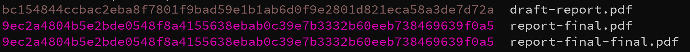

In my terminal, text often flies by. Things like log files, thread dumps, report output, etc. All of these are comprised of text, but not all of that text is equally important. This is the story of how I got my computer to highlight the important bits for me.

<!--more-->

# Background

At my last job, I worked on a streaming data platform (written in Clojure) that was the backbone of a couple of major esports leagues. It was responsible for taking data from the game servers and compiling and aggregating it before making it available for any thing that the on-air production needed, from showing a summary of the live game for the casters (so they can tell interesting stories) to making stat data available for insertion into on-air graphics (so fans can see just how good their favorite player is).

Clojure was an especially good fit due to it's functional nature, as most of the work was to transform and aggregate large trees of data quickly. The central structure of the application was a graph of workers that were independent threads connected via core.async channels. Each one handled a particular job or transform, passing data along to others.

One aspect of this system was responsible for acquiring data from the game servers. This was of supreme importance because this data was the source of truth for all statistics for the league. And statistics are the lifeblood of any sports league. Just ask baseball. It was because of this important task that during live broadcasts, I would often watch this component's logs to make sure that data was correctly captured.

This log was full of information, but the most important part was the notification that a game was transitioning through it's expected states. Each log related to a transition had the game id, a very long number.

```
2021-03-02 14:54:34 INFO - game lobby created, id: 3847192873987419834
2021-03-02 14:57:34 INFO - game started, id: 3847192873987419834
2021-03-02 15:10:34 INFO - game ended, id: 3847192873987419834
```

This was all well and good, but often games would overlap. Usually they were setting up the next game as the previous one was wrapping up.

```
2021-03-02 14:54:34 INFO - game lobby created, id: 3847192873987419834
2021-03-02 14:57:34 INFO - game started, id: 3847192873987419834
2021-03-02 15:01:34 INFO - game lobby created, id: 3847192873897419834
```

Scanning through this, it looks like the game started but then the lobby was created again. This could indicate that the data collector had lost its connection to the server, or something else had gone wrong with the game. However, if you look closely, that third ID is not the same as the first two. This (the looking closely) was really difficult to see when the logs are sliding past.

So I imagined a little script that could help me. This script would take the piped log and look for game IDs. It would have to take a regex to look for (2 problems!), and then it would then color each unique ID the same color so I could easily spot if a given ID was new or an indication of something more sinister. It seemed like something that should be possible. Unfortunately, I was also an adult with "other responsibilities", so I put the above idea into my list of Really Cool Scripts I Wish I Had, and muddled through by pausing my tmux window and searching for IDs manually.

# A solution appears

This problem was rolling around in my head and I was hoping to carve out some time to write a Babashka script when a most serendipitous thing happened. I came across [this blog post][1] by Steve Losh detailing his approach to writing small command line programs in Common Lisp. I'd read other posts on his blog, and this one intrigued me mostly because Babashka was becoming my go-to for small command line programs.

So I started reading. The first half of the post is all about the set up and structure of the place these scripts are born and grown. It was fairly interesting to me but then he starts describing a script he wrote using this system. It's called `batchcolor`, and it's "used to highlight regular expression matches in text (usually log files) with a twist: each unique match is highlighted in a separate color, which makes it easier to visually parse the result."

I was **floored**. Here was a script that did *exactly* what I needed and I didn't have to write it.

In my younger days, I would have been more sad that I wouldn't have the need to write it myself, but by this point I had definitely reached the point in my career where I firmly believed that the best piece of software is one you didn't write and got to just use. So, I immediately set to figuring out how to set up a Common Lisp environment (very simple in Linux) and then to compile this into a standalone binary (thankfully, the top half of the blog post was very helpful). Before too long, I had a shiny little binary that I began using right away.

I found a few more uses for it over the years. Then, when I got my current job, I had to go through the compilation process again (was on MacOS now), and I've been happily using `batchcolor` to highlight strings. I've kept those two binaries safely backed up so I can copy them to new systems and I've also shared them with a few friends.

# My own batchcolor

All was well and good, and I happily used `batchcolor` to highlight matches in logs and other output. It was a little annoying to copy that binary from system to system, and there were a couple of edge cases that I wished I could fix, but none of that caused enough pain to motivate me to write my own version.

Then, recently, I had the need for a script that did something similar to `batchcolor`, but slightly different. It was a script to color the AGE column of `kubectl get pod` so that newer pods are easier to spot. In the process of writing this script, I discovered that [clojure.string's replace function][2] supports passing a function as the `replacement` argument. It made writing the AGE highlighter trivial, and it made me realize that my own version of `batchcolor` was closer than I originally thought.

So I took another look at the color selection code in `batchcolor` and quickly ported it to Clojure. Then, with `string/replace` doing the heavy lifting, I was able to write my own version, called [`highlight`][3].

# How I highlight

I usually put the `highlight` command at the end of the pipeline, like this:

```bash
some --command | grep important | highlight '(what|I)really.*need'
```

Every once in a while, I will write the `highlight` regex by hand on the command line, but for the most part I write small scripts that are easier to remember. For instance, here's a script called `hl-sha`, which hightlights md5 and sha256 sums:

```bash
#!/usr/bin/env bash

highlight '[0-9a-ef]{32,}'
```

Then, I can run `sha256 * | hl-sha` and get something like this:



This is a rather trivial example, but you can see how the coloring instantly confirms that the last two files are identical.

And, for my log file example above, this script (called `hl-game-id`) would suffice:

```bash
#!/usr/bin/env bash

highlight '\d{15,}'
```

Running `tail -f game.log | hl-game-id` would look like this:


See how much easier it is to spot the change in game id?

Here are a few other scripts I've written:
* `hl-ip4` - Highlights IPv4 addresses.
* `hl-uuid` - Highlights UUIDs, handy for spotting account IDs in logs.
* `hl-sw-version` - Highlights microservice versions (at work). I have a separate script that prints out all service versions in all environments, so this helps show which ones are out of sync.

# One more thing

One unexpected bonus that came out of porting this to Babashka is that I can use the highlighting functionality in other scripts.

Here's a trivial example:

```clojure
#!/usr/bin/env bb

(ns script
  (:require [babashka.deps :as deps]))

(deps/add-deps '{:deps {io.github.justone/bb-scripts {:sha "e2b58b70fb365b51cdce2e19a2162721d0f5ceb3"}}})
(require '[lib.highlight :as highlight])

(defn process
  []
  ["This is super important."
   "This is somewhat important."
   "This is not really important."])

(when (= *file* (System/getProperty "babashka.file"))
  (->> (process)
       (map #(highlight/add % #"super|somewhat|not really|important"))
       (run! println)))
```

And the output looks like this:


This ability to quickly use libraries like this puts Babashka in a class all its own.

# Wrapping up

If you'd like to try out `highlight`, you can download the self-contained script [here][4], or run this to install it with [bbin][5]:

```bash
bbin install io.github.justone/bb-scripts --main-opts '["-m" "highlight"]' --as highlight
```

Enjoy.

[1]: https://stevelosh.com/blog/2021/03/small-common-lisp-cli-programs/
[2]: https://clojuredocs.org/clojure.string/replace
[3]: https://github.com/justone/bb-scripts#current-scripts
[4]: https://github.com/justone/bb-scripts/blob/master/uberscripts/highlight
[5]: https://github.com/babashka/bbin
